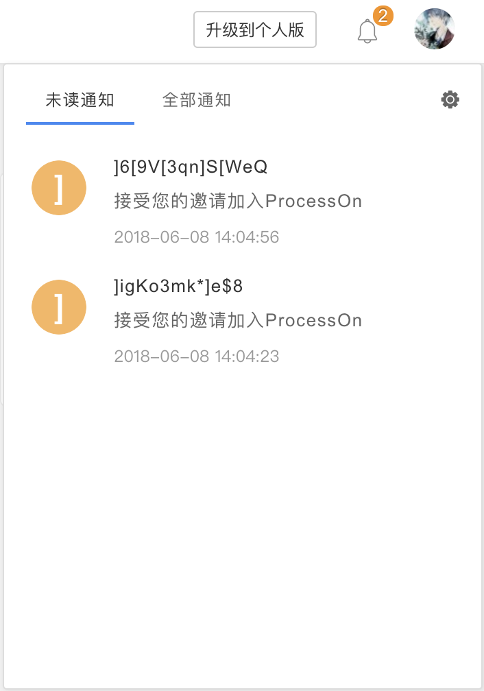

# process-on-helper
利用[processon](https://www.processon.com/)的“这是你的专属邀请链接，通过此链接注册ProcessOn后，你会获得3张文件数量的奖励”，增加`processon`文件保存数量。

## 用法
```
node app.js
```

## 效果



## TODO
- [ ] 回调地狱
- [ ] 并行执行tasks
- [ ] 命令行交互
- [ ] 发布到`npm`

## 协议
[MIT](./LICENSE)